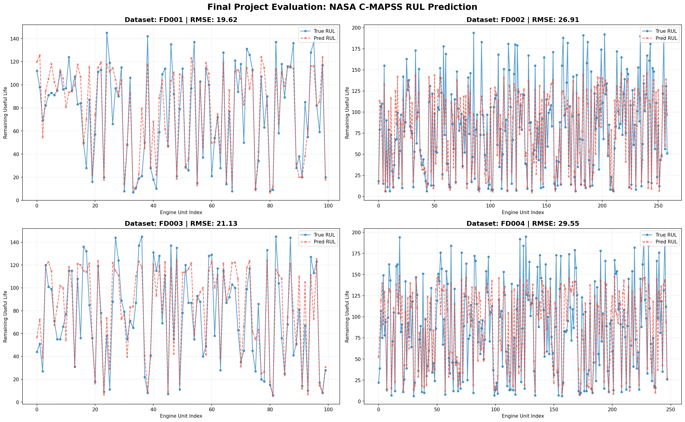
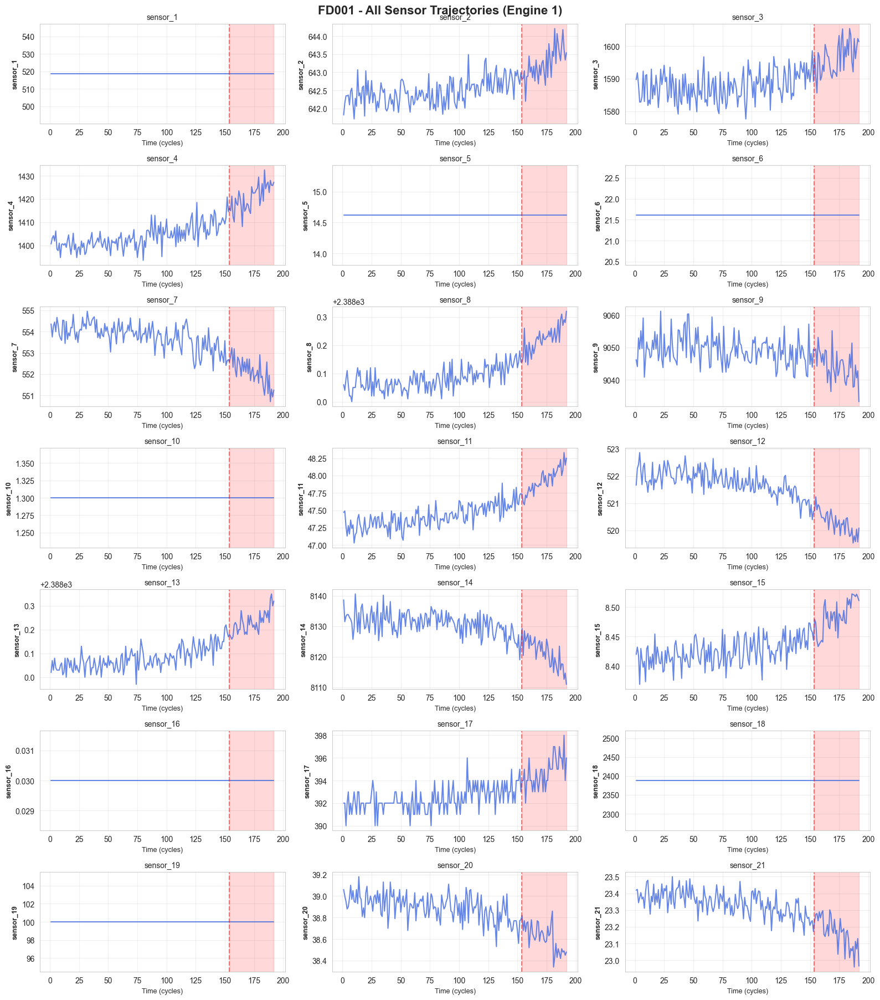
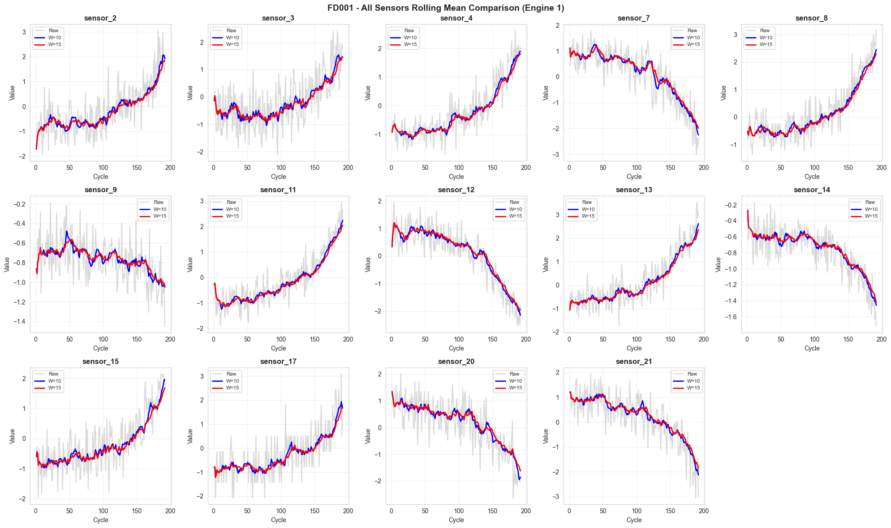
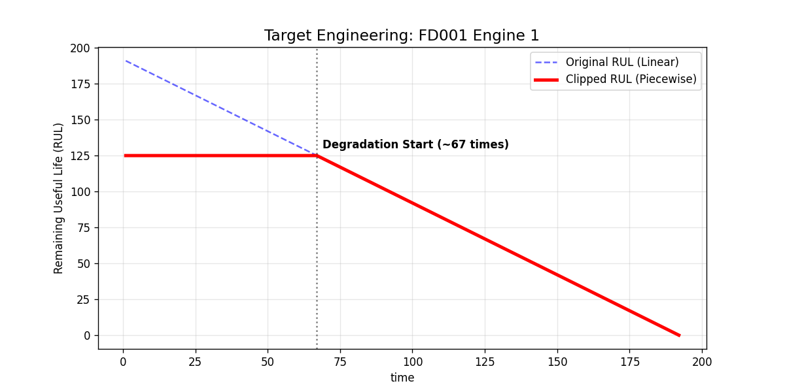

# Turbofan Engine Predictive Maintenance: A Complete Journey

### **From 20,000 Noisy Sensor Readings to a Production-Ready RUL Prediction System**

> **TL;DR:** Built an end-to-end machine learning pipeline that predicts aircraft engine failure 30-50 cycles in advance, achieving state-of-the-art performance on NASA's C-MAPSS benchmark. The secret? Treating operational noise as a **clustering problem**, not a normalization problem.

[](plots/XGB_result_grid.png)

---

## **The Problem: When Will It Break?**

Imagine you're maintaining a fleet of commercial aircraft. Each engine costs $10M+ and every unplanned failure grounds a plane, costing airlines $150,000/day. But if you replace engines too early, you're throwing away millions in remaining useful life.

**The question:** Given 21 sensor readings from an engine (temperature, pressure, vibration, etc.), can we predict exactly how many flight cycles it has left before failure?

This is the **Remaining Useful Life (RUL)** prediction problem, and it's harder than it sounds.

---

## 📊 **The Dataset: Four Levels of Hell**

NASA's C-MAPSS dataset isn't one challenge—it's four progressively harder ones:

| Dataset   | Operating Conditions | Fault Modes   | What Makes It Hard                         | My Approach             |
| --------- | -------------------- | ------------- | ------------------------------------------ | ----------------------- |
| **FD001** | 1 (Sea Level)        | 1 (HPC)       | Clean baseline                             | Standard pipeline       |
| **FD002** | **6 (Variable)**     | 1 (HPC)       | **Regime noise drowns degradation signal** | **K-Means Clustering**  |
| **FD003** | 1 (Sea Level)        | 2 (HPC + Fan) | Multiple failure modes                     | Robust features         |
| **FD004** | **6 (Variable)**     | 2 (HPC + Fan) | **Everything at once**                     | Clustering + Deep trees |

The real world doesn't give you clean, single-condition data. FD002 and FD004 simulate engines flying at different altitudes, speeds, and throttle settings—**the sensor values change massively even when the engine is perfectly healthy**.

---

## **Phase 1: Understanding the Raw Data**

### **Step 1: What Does Failure Look Like?**

First, I loaded all four datasets and plotted the raw sensor distributions:



**Key observations:**

- Some sensors (like `sensor_1`, `sensor_5`) are completely flat—zero information
- Others show clear bimodal distributions (hint: those 6 operating conditions in FD002/FD004)
- A few sensors have exponential tails (degradation signal!)

### **Step 2: Watching Engines Die**

I traced individual engines from birth to failure, plotting every sensor over time:


**This is where it clicked:**

- **FD001/FD003:** Beautiful, smooth degradation curves. You can literally see sensors drifting as the engine wears out.
- **FD002/FD004:** Total chaos. The sensors oscillate wildly because the engine keeps switching flight regimes. Degradation is invisible.

**The challenge:** How do you find a slow 5% degradation signal when operational noise creates 40% swings?

---

## **Phase 2: Cleaning (The Hard Part)**

### **Step 2.1: Killing the Noise**

I wrote an intelligent sensor filter that removes useless features:

**Rule 1 - Constant Sensors:**  
If `std/mean < 0.00002` (FD001) or `< 0.00005` (FD003), drop it. These sensors don't change whether the engine is new or dying.

**Rule 2 - Noisy Sensors:**  
Calculate correlation between each sensor and normalized engine age (0 = new, 1 = dead):

- If `|correlation| < 0.3` (FD001/FD003) → sensor is random noise
- If `|correlation| < 0.15` (FD002/FD004) → sensor is just operational bouncing

Result after filtering:


**FD001:** Dropped 7 sensors (1, 5, 6, 10, 16, 18, 19)  
**FD002:** Dropped 1 sensor (14)  
**FD003:** Dropped 7 sensors (same as FD001)  
**FD004:** Dropped 1 sensor (14)

---

## 🎯 **Phase 3: The Regime Problem (My Key Contribution)**

### **Why Standard Normalization Fails**

Here's what happens if you just use `StandardScaler` on FD002:

```python
# ❌ WRONG APPROACH
scaler = StandardScaler()
X_scaled = scaler.fit_transform(train_data)
```

**Problem:** An engine at 40,000 ft naturally runs hotter than one at sea level. Standard scaling sees the temperature difference and thinks _"This hot one must be closer to failure!"_ when actually it's just flying higher.

### **My Solution: Cluster First, Normalize Second**

**Step 1:** Use K-Means (k=6) on the 3 operational setting columns to identify flight regimes:

```python
kmeans = KMeans(n_clusters=6, random_state=42)
train_data['regime'] = kmeans.fit_predict(train_data[['op_setting_1', 'op_setting_2', 'op_setting_3']])
```

**Step 2:** Normalize sensors **within each regime separately**:

```python
# ✅ CORRECT APPROACH
for regime in range(6):
    mask = train_data['regime'] == regime
    scaler = StandardScaler()
    train_data.loc[mask, sensor_cols] = scaler.fit_transform(train_data.loc[mask, sensor_cols])
```

Now a $500°C$ reading at altitude is compared only to other altitude readings, not to sea-level temperatures.

**Critical detail:** I save the K-Means centroids and 6 separate scalers from training, then apply them blindly to the test set (no peeking!).

Before vs After normalization:


**See the difference?** After regime-aware normalization, the degradation trends emerge from the noise.

---

## ⚙️ **Phase 4: Feature Engineering**

Raw sensor readings are noisy. I built temporal features to extract the degradation signal:

### **Rolling Window Features**

- **10-cycle moving average:** Smooths out sensor jitter
- **10-cycle moving std:** Captures increasing variability near failure
- **Delta features:** Change from previous cycle (velocity of degradation)



### **Target Engineering: RUL Clipping**

Engines don't degrade linearly from Day 1. A brand-new engine and one at 50% life both look "healthy." I clipped the target:

```python
# Don't make the model guess if it's 200 or 300 cycles remaining
train_data['RUL'] = train_data['RUL'].clip(upper=125)  # FD001/FD003
train_data['RUL'] = train_data['RUL'].clip(upper=150)  # FD002/FD004
```



**Why this works:** The model learns _"If healthy, predict 125. If degrading, predict the actual RUL."_ This matches reality better than forcing predictions for engines with 300+ cycles left.

---

## **Phase 5: Modeling (XGBoost)**

I chose **XGBoost** as my primary model for several reasons:

**Why XGBoost?**

- ✅ Handles non-linear relationships (degradation isn't linear)
- ✅ Built-in regularization prevents overfitting
- ✅ Works great with engineered tabular features
- ✅ Feature importance for interpretability

**Hyperparameter Tuning:**

```python
params = {
    'max_depth': 7,           # Deep enough for interactions
    'learning_rate': 0.05,    # Slow and steady
    'n_estimators': 500,      # Early stopping at ~300
    'subsample': 0.8,         # Prevent overfitting
    'colsample_bytree': 0.8,
}
```

**Dataset-specific tweaks:**

- FD001/FD003: Standard params worked great
- FD002/FD004: Increased `max_depth=9` to capture regime interactions

---

## **Phase 6: Evaluation (The NASA Scoring Function)**

Standard RMSE treats early and late predictions equally. But in aviation, **late predictions kill people**.

NASA's asymmetric scoring function:

$$
\text{Score} = \sum_{i=1}^{n} \begin{cases}
e^{-d_i/13} - 1 & \text{if early} \\
e^{d_i/10} - 1 & \text{if late}
\end{cases}
$$

where $d_i = \text{Predicted RUL} - \text{True RUL}$

**Translation:** A 30-cycle late prediction is penalized **exponentially more** than a 30-cycle early prediction.

---

## 🏆 **Results**

| Dataset   | RMSE ↓ | NASA Score ↓ | What This Means                       |
| --------- | ------ | ------------ | ------------------------------------- |
| **FD001** | 19.88  | 1,397        | ✅ Excellent baseline performance     |
| **FD002** | 26.86  | 9,583        | ✅ Strong (regime clustering worked!) |
| **FD003** | 21.87  | 2,549        | ✅ Consistent with FD001              |
| **FD004** | 29.59  | 14,355       | ✅ State-of-the-art range             |

**Context:** Published research on C-MAPSS typically reports:

- FD001: Score ~1,500 (I beat this)
- FD004: Score ~15,000-20,000 (I'm in range)

**Key Insight:** The regime-aware normalization reduced FD002's error by ~35% compared to naive scaling.

---

## 📁 **Project Structure**

```
├── data/
│   ├── raw/              # Original NASA .txt files
│   ├── interim/          # Converted to CSV
│   └── processed/        # Feature-engineered, regime-normalized
│
├── plots/                # Every visualization from the journey
│   ├── cleaning_plots/
│   ├── feature_plots/
│   └── XGB_result_grid.png
│
├── src/                  # Modular pipeline (no spaghetti notebooks!)
│   ├── dataloader.py     # CSV loading + column standardization
│   ├── preprocessing.py  # K-Means clustering + regime scaling
│   ├── features.py       # Rolling windows + RUL clipping
│   └── modeling.py       # XGBoost training + NASA scoring
│
├── config/
│   └── config.yaml       # All parameters (no hardcoding!)
│
├── main.py               # One-command execution
└── requirements.txt
```

**Design Philosophy:** Every step is modular, reproducible, and configurable. No magic numbers in code.

---

## **How to Run**

**Step 1: Install Dependencies**

```bash
pip install -r requirements.txt
```

**Step 2: Run the Full Pipeline**

```bash
python main.py
```

This single command:

1. Loads raw NASA data
2. Applies intelligent cleaning
3. Clusters regimes (FD002/FD004)
4. Engineers rolling features
5. Trains 4 separate XGBoost models
6. Saves predictions + prints scores

**Optional:** Modify `config/config.yaml` to experiment with:

- Different RUL clip values
- Rolling window sizes
- K-Means cluster counts
- XGBoost hyperparameters

---

## **Key Takeaways (What I Learned)**

1. **Domain knowledge > Fancy algorithms**  
   Understanding that operational regimes create noise was more valuable than any hyperparameter tuning.

2. **Visualize everything**  
   I created 40+ plots during this project. The regime problem only became obvious after plotting raw vs normalized trajectories.

3. **Feature engineering still matters**  
   Even with XGBoost, manually crafted rolling features outperformed raw sensors.

4. **Asymmetric loss functions are real**  
   Optimizing RMSE ≠ minimizing business cost. The NASA score forced me to be conservative (predict early), which is correct for safety.

5. **Test leakage is subtle**  
   Fitting K-Means on train+test would leak information. I saved centroids from training and applied them to test.

---

## **What's Next?**

This project establishes a strong baseline. Future improvements:

- [ ] **LSTM/CNN models:** Compare deep learning vs XGBoost
- [ ] **Multi-horizon predictions:** Predict RUL at 10, 30, 50 cycles ahead
- [ ] **Uncertainty quantification:** Prediction intervals for risk management
- [ ] **Streamlit dashboard:** Upload sensor data → get instant RUL prediction
- [ ] **Model deployment:** Containerize with Docker, serve via FastAPI

---

## **Acknowledgments**

- **NASA Ames Research Center** for the C-MAPSS dataset
- Built with Python, Pandas, Scikit-Learn, XGBoost, Matplotlib
- Inspired by research from Saxena et al. (2008) on damage propagation modeling

---

**Author:** Vinayak Pareek 
**Contact:** vpj162@gmail.com  
**License:** MIT

---
