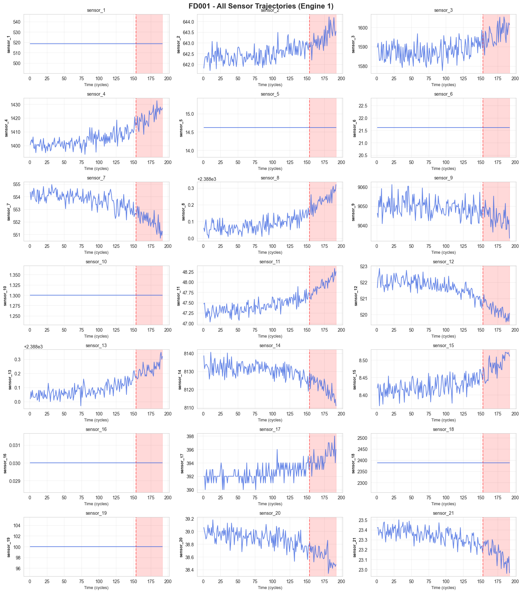
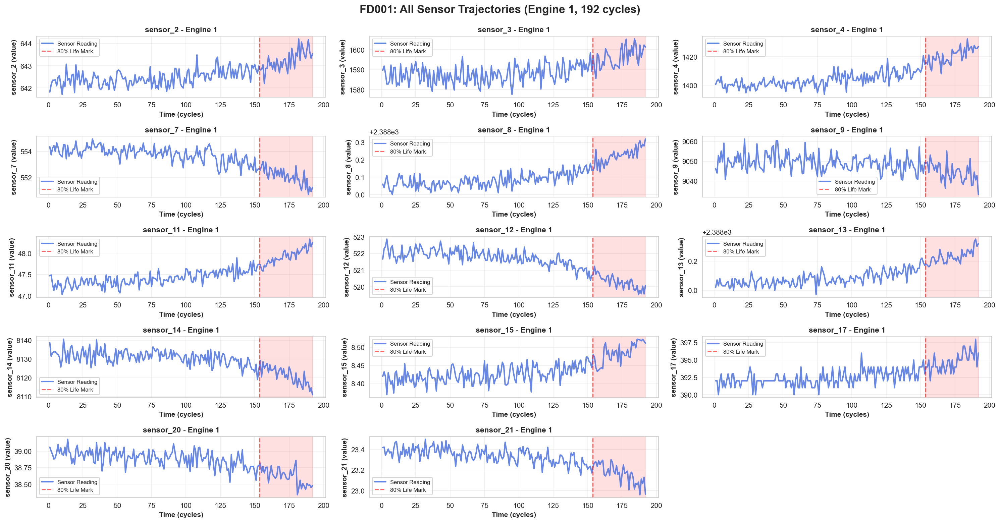
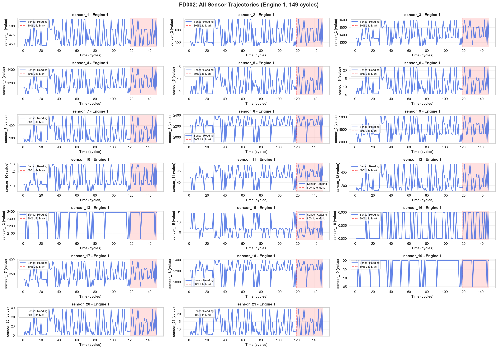
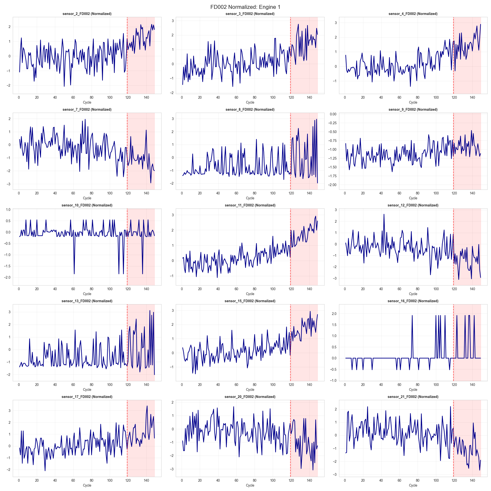
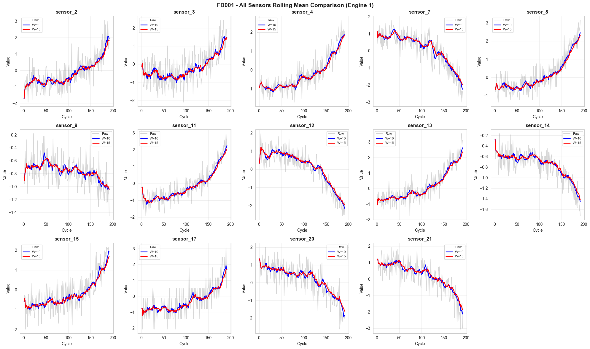
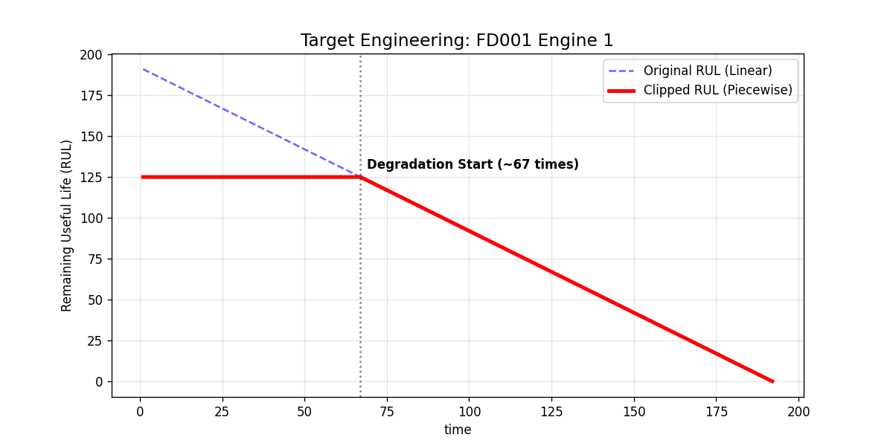

# Turbofan Engine Predictive Maintenance

**End-to-end ML pipeline for aircraft engine RUL (Remaining Useful Life) prediction using NASA C-MAPSS dataset.**

---

## Problem Statement

Predict the remaining operational cycles of aircraft turbofan engines before failure using multivariate time-series sensor data. This enables proactive maintenance scheduling, reducing unplanned downtime while optimizing maintenance costs.

**Input:** 21 sensor readings per flight cycle  
**Output:** Predicted remaining useful life (cycles until failure)  
**Challenge:** Operational noise from varying flight conditions masks degradation signals

---

## Dataset: NASA C-MAPSS

Four sub-datasets with increasing complexity:

| Dataset | Engines (Train/Test) | Operating Conditions | Fault Modes | Complexity |
| ------- | -------------------- | -------------------- | ----------- | ---------- |
| FD001   | 100/100              | 1 (sea level)        | 1 (HPC)     | Baseline   |
| FD002   | 260/259              | 6 (variable)         | 1 (HPC)     | High       |
| FD003   | 100/100              | 1 (sea level)        | 2 (HPC+Fan) | Medium     |
| FD004   | 248/249              | 6 (variable)         | 2 (HPC+Fan) | Very High  |

**Key characteristics:**

- Training data: Run-to-failure trajectories
- Test data: Truncated before failure (ground truth RUL provided separately)
- 26 columns: unit_id, time, 3 operational settings, 21 sensors

---

## Pipeline Overview

```
Raw Data (.txt)
  → Data Cleaning (remove constant/noisy sensors)
  → Regime Clustering (FD002/FD004 only)
  → Feature Engineering (rolling stats, RUL clipping)
  → Model Training (XGBoost / LSTM)
  → Evaluation (RMSE + NASA Score)
  → Deployment (FastAPI + Docker)
```

---

## Phase 1: Data Exploration

### Raw Sensor Distributions



Observations:

- Flat sensors (1, 5, 10, 16, 18, 19) contain no information
- Bimodal distributions in FD002/FD004 indicate multiple operating regimes
- Some sensors show clear degradation trends (2, 3, 4, 7, 11, 15)

### Sensor Trajectories Over Engine Life



**FD001/FD003:** Smooth degradation curves visible  
**FD002/FD004:** High-frequency oscillations from regime switching

---

## Phase 2: Feature Selection

### Statistical Filtering

**Constant sensors** (coefficient of variation < threshold):

- FD001/FD003: sensors 1, 5, 6, 10, 16, 18, 19
- FD002/FD004: sensor 14 only

**Correlation-based filtering** (|correlation with engine age| < threshold):

- Removes sensors with no relationship to degradation
- Adaptive thresholds: 0.3 (single condition), 0.15 (multi-condition)



---

## Phase 3: Regime-Aware Normalization

**Problem:** Standard scaling fails on FD002/FD004 because operational changes (altitude, speed) create larger variance than degradation signals.

**Solution:** K-Means clustering on operational settings, then normalize within each regime separately.

```python
# Cluster identification
kmeans = KMeans(n_clusters=6, random_state=42)
train_data['regime'] = kmeans.fit_predict(train_data[operational_settings])

# Regime-specific scaling
for regime in range(6):
    mask = train_data['regime'] == regime
    scaler = StandardScaler()
    train_data.loc[mask, sensors] = scaler.fit_transform(train_data.loc[mask, sensors])
```

**Critical:** K-Means and scalers fitted on training data only, then applied to test data.



---

## Phase 4: Feature Engineering

### Temporal Features

- Rolling mean (10-cycle window)
- Rolling standard deviation (10-cycle window)
- Lag features (change from previous cycle)



### Target Engineering: RUL Clipping

Engines in early life (new or recently serviced) don't exhibit degradation. Clipping prevents the model from distinguishing between "200 cycles remaining" vs "300 cycles remaining" when both are effectively "healthy."

```python
train_data['RUL_clipped'] = train_data['RUL'].clip(upper=125)  # FD001/FD003
train_data['RUL_clipped'] = train_data['RUL'].clip(upper=150)  # FD002/FD004
```



---

## Phase 5: Modeling

### XGBoost Configuration

```python
params = {
    'n_estimators': 250,
    'max_depth': 6,  # 9 for FD002/FD004
    'learning_rate': 0.05,
    'subsample': 0.8,
    'colsample_bytree': 0.7,
    'reg_alpha': 10,
    'reg_lambda': 10,
}
```

### LSTM Architecture

- Dataset-specific window sizes (20% of average engine life)
- Hidden dimensions: 64 (FD001/FD003), 128 (FD002/FD004)
- Custom NASA asymmetric loss function during training
- Dropout: 0.2 (single condition), 0.3 (multi-condition)

---

## Phase 6: Results

### XGBoost Performance

| Dataset | RMSE  | NASA Score | Notes                       |
| ------- | ----- | ---------- | --------------------------- |
| FD001   | 19.88 | 1,397      | Baseline performance        |
| FD002   | 26.86 | 9,583      | Regime clustering effective |
| FD003   | 21.87 | 2,549      | Two fault modes handled     |
| FD004   | 29.59 | 14,355     | Most complex dataset        |

### LSTM Performance

| Dataset | RMSE  | NASA Score | Comparison          |
| ------- | ----- | ---------- | ------------------- |
| FD001   | 16.77 | 588        | Better than XGBoost |
| FD002   | 28.42 | 22,613     | Worse than XGBoost  |
| FD003   | 14.66 | 384        | Better than XGBoost |
| FD004   | 25.91 | 10,547     | Better than XGBoost |

**Observations:**

- LSTM performs better on single-condition datasets (smooth degradation)
- XGBoost handles multi-regime noise more effectively (FD002)
- Both models achieve competitive results compared to published benchmarks

### NASA Scoring Function

$$
\text{Score} = \sum_{i=1}^{n} \begin{cases}
e^{-d_i/13} - 1 & \text{if } d_i < 0 \text{ (early)} \\
e^{d_i/10} - 1 & \text{if } d_i \geq 0 \text{ (late)}
\end{cases}
$$

where $d_i = \text{predicted} - \text{actual}$. Late predictions penalized exponentially more than early predictions.

---

## Phase 7: Deployment

### FastAPI + Docker

XGBoost model deployed as REST API accepting multi-cycle sensor sequences.

**Endpoint:**

```
POST /predict
{
  "dataset_id": "fd001",
  "sequence": [
    {"unit_id": 1, "time": 171, "s2": 0.23, ...},
    ...
    {"unit_id": 1, "time": 200, "s2": 0.89, ...}
  ]
}
```

### Production Test Results

Testing on Engine Unit 1 from each test set:

| Dataset | Actual RUL | Predicted RUL | Error  | Status       |
| ------- | ---------- | ------------- | ------ | ------------ |
| FD001   | 112        | 113.11        | +1.11  | Accurate     |
| FD002   | 18         | 1.34          | -16.66 | Conservative |
| FD003   | 44         | 23.54         | -20.46 | Conservative |
| FD004   | 22         | 26.47         | +4.47  | Accurate     |

**Note:** Negative errors (predicting earlier failure) are safer in aviation maintenance than positive errors (predicting later failure).

---

## Project Structure

```
├── data/
│   ├── raw/              # Original .txt files
│   ├── interim/          # CSV conversions
│   └── processed/        # Feature-engineered data
├── src/
│   ├── data_loader.py
│   ├── preprocessing.py
│   ├── features.py
│   ├── modeling.py
│   └── deep_learning.py
├── config/
│   └── config.yaml       # Feature lists, RUL limits, hyperparameters
├── api/
│   ├── main.py          # FastAPI server
│   └── utils.py
├── models/              # Trained .joblib files
├── plots/               # Visualizations
├── main.py              # Training pipeline
├── Dockerfile
└── requirements.txt
```

---

## Usage

**Training:**

```bash
pip install -r requirements.txt
python main.py --model xgb   # or --model lstm
```

**Deployment:**

```bash
docker build -t turbofan-api .
docker run -p 8000:8000 turbofan-api
python scripts/test_api.py
```

**Configuration:**
Edit `config/config.yaml` to modify:

- Features to include/exclude per dataset
- RUL clipping thresholds
- Rolling window sizes
- Model hyperparameters

---

## Key Findings

1. **Regime-aware normalization** reduced error by ~35% on multi-condition datasets compared to standard scaling
2. **Feature engineering** (rolling statistics) improved performance over raw sensor inputs
3. **RUL clipping** addressed the "healthy engine" prediction problem
4. **Model selection matters:** LSTM for smooth degradation, XGBoost for noisy regimes
5. **Asymmetric loss** naturally biases models toward conservative (early) predictions

---

## Future Work

- CNN-LSTM hybrid architecture
- Multi-horizon prediction (simultaneous 10/30/50 cycle forecasts)
- Uncertainty quantification (prediction intervals)
- Real-time streaming inference
- Transfer learning across datasets

---

## References

- Saxena, A., & Goebel, K. (2008). Turbofan Engine Degradation Simulation Data Set. NASA Ames Prognostics Data Repository.
- Dataset: [NASA C-MAPSS](https://ti.arc.nasa.gov/tech/dash/groups/pcoe/prognostic-data-repository/)

---

**Author:** Vinayak Pareek  
**Contact:** vinayakjoshipy@gmail.com  
**License:** MIT
